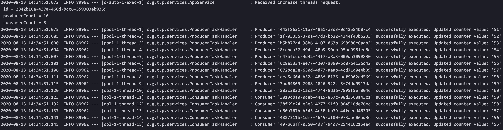

Written in Java 11 and Spring Boot 2.3

### Build and Run

To compile and package the application
```
make build
```

To create the docker image of the application
```
make docker-image
```

To run the app with MySQL
```
make run
```

To stop the app
```
make stop
```

### APIs

#### Increase Producer and Consumer Threads
##### Path
    POST http://localhost:8080/increaseThreads
##### Request Body
    {
        "producerCount": 2,
        "consumerCount": 2
    }
##### Sample Request
    $ curl 'http://localhost:8080/increaseThreads' -i -X POST \
        -H 'Content-Type: application/json' \
        -d '{"producerCount": 2, "consumerCount": 2}' 
##### Example Response
    HTTP/1.1 202 ACCEPTED
    Content-Type: application/json;charset=UTF-8
    
    {
        "requestId": "e5c4c1c9-9ba5-4f52-8d43-672374e8eef8"
    }

#### Get Request Information
##### Path
    GET http://localhost:8080/requestLogs/{requestId}
##### Sample Request
    $ curl 'http://localhost:8080/requestLogs/e5c4c1c9-9ba5-4f52-8d43-672374e8eef8' -i -X GET \
        -H 'Content-Type: application/json'
        
##### Sample Response
    HTTP/1.1 200 OK
    Content-Type: application/json;charset=UTF-8
    
    {
        "id": "e5c4c1c9-9ba5-4f52-8d43-672374e8eef8",
        "producerCount": 2,
        "consumerCount": 2,
        "timestamp": "2020-08-13T14:50:56.582507",
        "consumers": [
            {
                "id": "4f6712ca-715b-40e2-9105-cf944c507023",
                "requestId": "1aa75de9-2c80-4d99-9d9e-e1927faf3766",
                "updatedCounterValue": 51,
                "executed": true
            },
            {
                "id": "577a536b-cd8e-4b4c-bd97-c2eee5b7827a",
                "requestId": "1aa75de9-2c80-4d99-9d9e-e1927faf3766",
                "updatedCounterValue": 50,
                "executed": true
            }
        ],
        "producers": [
            {
                "id": "76529f32-973a-46f0-b31f-16a88666d533",
                "requestId": "1aa75de9-2c80-4d99-9d9e-e1927faf3766",
                "updatedCounterValue": 52,
                "executed": true
            },
            {
                "id": "d9216b62-8a65-47e9-a5bb-70db82c6c3b1",
                "requestId": "1aa75de9-2c80-4d99-9d9e-e1927faf3766",
                "updatedCounterValue": 51,
                "executed": true
            }
        ]
    }
    
#### Update Counter Value
##### Path
      PUT http://localhost:8080/updateCounterValue
##### Request Body
    {
        "value": 100
    }
##### Sample Request
    $ curl 'http://localhost:8080/updateCounterValue' -i -X POST \
        -H 'Content-Type: application/json' \
        -d '{"value": 100}' 
##### Example Response
    HTTP/1.1 200 OK
##### Example Error Response
    HTTP/1.1 400 BAD REQUEST
    Content-Type: application/json;charset=UTF-8
    
    {
        "message": "counter value cannot be less than 0 or more than 100"
    }
    
    
#### Get Counter Value
##### Path
    GET http://localhost:8080/counter
##### Sample Request
    $ curl 'http://localhost:8080/counter' -i -X GET \
        -H 'Content-Type: application/json'
##### Sample Response
##### Sample Response
    HTTP/1.1 200 OK
    Content-Type: application/json;charset=UTF-8
    
    {
        "value": 50
    }

### Trace Logs


### Integration Test Snippet

    @Test
    void givenRequest_whenIncreaseThreads_thenReturnAcceptedResponse() {

        var increaseThreadsRequest = new IncreaseThreadsRequest();
        increaseThreadsRequest.setProducerCount(10);
        increaseThreadsRequest.setConsumerCount(5);

        var requestId = given().header("Content-Type", "application/json").body(increaseThreadsRequest)
                        .when().post("/increaseThreads")
                        .then().statusCode(202).body("$", notNullValue()).extract().path("requestId");

        // verify request log
        var requestLog = given().header("Content-Type", "application/json")
                        .when().get("/requestLogs/{requestId}", requestId)
                        .then().statusCode(200).extract().as(RequestLog.class);

        assertThat(requestLog).isNotNull();
        assertThat(requestLog.getConsumerCount()).isEqualTo(5);
        assertThat(requestLog.getProducerCount()).isEqualTo(10);
        assertThat(requestLog.getProducers()).isNotEmpty();
        assertThat(requestLog.getConsumers()).isNotEmpty();

        // verify counter value
        var counter = given().header("Content-Type", "application/json")
                .when().get("/counter")
                .then().extract().path("value");
        assertThat(counter).isEqualTo(55);
    }